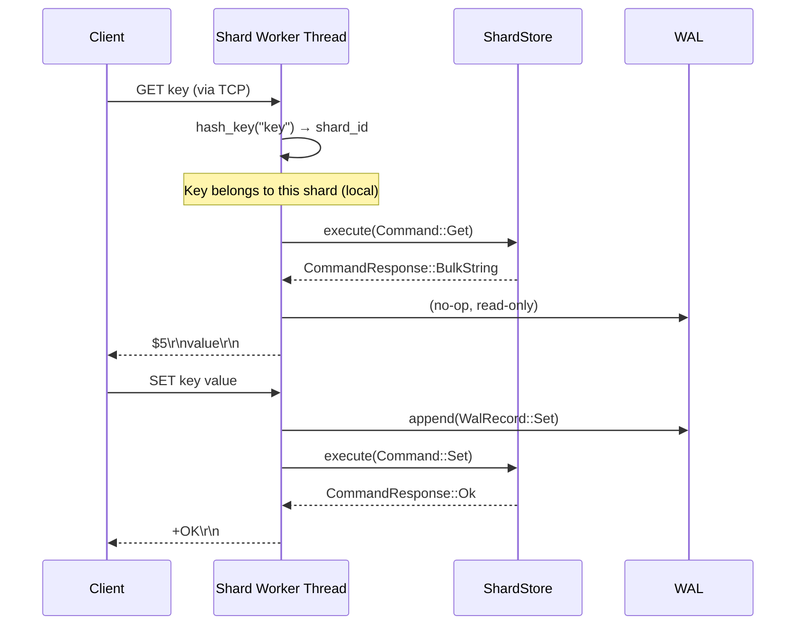
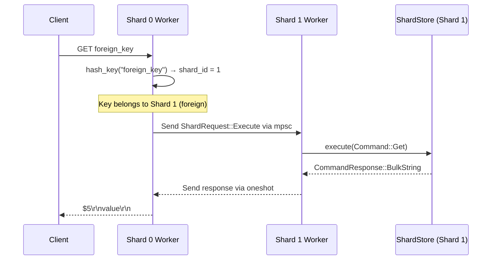

## Overview

Kora is built on a **shared-nothing, shard-affinity threading architecture** that eliminates lock contention on the data path and achieves linear scaling with CPU cores. Each worker thread owns both its data and its connection I/O, running a dedicated `current_thread` Tokio runtime with zero synchronization overhead for local-key operations.

<Note>
Kora's architecture is inspired by Seastar (C++) and ScyllaDB's thread-per-core model, but implemented in safe Rust with async I/O via Tokio.
</Note>

## Core Design Principles

### 1. Shared-Nothing Threading

Each shard worker thread maintains complete ownership of:
- Its portion of the keyspace (determined by hash-based routing)
- All data structures for keys in that shard
- Connection I/O for clients that last accessed local keys
- A single-threaded Tokio runtime (`current_thread`)

**No locks on the data path.** Store access uses `Rc<RefCell<>>` instead of `Arc<Mutex<>>`:

```rust
// From kora-server/src/shard_io/mod.rs:343
let store = Rc::new(RefCell::new(ShardStore::new(i as u16)));
let wal = Rc::new(RefCell::new(wal_writer));
```

### 2. Shard-Affinity I/O

Connections are owned by the shard that last executed a command for that connection. The server uses `SO_REUSEPORT` to let the kernel distribute incoming connections across shard threads:

```rust
// From kora-server/src/shard_io/mod.rs:436
#[cfg(not(windows))]
socket.set_reuseport(true)?;
socket.bind(socket_addr)?;
socket.listen(65535)
```

Each shard worker runs its own TCP listener, eliminating a dedicated accept thread.

### 3. Hash-Based Key Routing

Every key is deterministically routed to a shard using a fast non-cryptographic hash (ahash):

```rust
// From kora-core/src/hash.rs:14
pub fn hash_key(key: &[u8]) -> u64 {
    let mut hasher = AHasher::default();
    key.hash(&mut hasher);
    hasher.finish()
}

pub fn shard_for_key(key: &[u8], shard_count: usize) -> u16 {
    (hash_key(key) % shard_count as u64) as u16
}
```

## Component Architecture

Kora is a Rust workspace monorepo with strict acyclic dependencies:

```
kora/
├── kora-core/              # Data structures, shard engine, memory management
│   ├── hash.rs            # Key hashing & shard routing (shard_for_key)
│   ├── shard/engine.rs    # ShardEngine, worker threads, crossbeam channels
│   ├── shard/store.rs     # ShardStore, command execution (single-threaded)
│   ├── types/value.rs     # Value enum (String, Int, List, Hash, Set, Stream)
│   └── command.rs         # Command/CommandResponse enums
│
├── kora-protocol/         # RESP2 streaming parser and serializer
│   ├── parser.rs          # RespParser with zero-copy fast paths
│   ├── serializer.rs      # serialize_response (CommandResponse → RESP bytes)
│   ├── resp.rs            # RespValue enum
│   └── command.rs         # parse_command (RespValue → Command)
│
├── kora-server/           # TCP/Unix server, shard-affinity I/O engine
│   ├── shard_io/mod.rs    # ShardIoEngine, per-shard Tokio runtimes
│   ├── shard_io/connection.rs  # RESP connection handler with pipelining
│   └── shard_io/dispatch.rs    # Cross-shard fan-out for multi-key commands
│
├── kora-storage/          # Persistence layer
│   ├── wal.rs             # Write-Ahead Log (CRC-32C, configurable sync)
│   ├── rdb.rs             # RDB snapshots (atomic writes, CRC verification)
│   ├── backend.rs         # StorageBackend trait, FileBackend
│   └── manager.rs         # StorageManager (WAL + RDB coordination)
│
├── kora-vector/           # HNSW approximate nearest neighbor index
├── kora-doc/              # JSON document database with secondary indexes
├── kora-cdc/              # Change data capture with per-shard ring buffers
├── kora-pubsub/           # Publish/subscribe messaging with glob patterns
├── kora-observability/    # Hot-key detection (Count-Min Sketch), stats
└── kora-embedded/         # Library mode API (no network)
```

<Info>
`kora-core` has **zero** internal workspace dependencies. Everything flows downward — never introduce circular dependencies.
</Info>

## Data Flow

### Local-Key Command (Fast Path)



**Zero channel hops.** The command executes inline on the worker's event loop.

### Foreign-Key Command (Cross-Shard Hop)



**One async hop** via `tokio::sync::mpsc` + `oneshot` response channel.

### Multi-Key Command (Fan-Out)

Commands like `MGET`, `MSET`, `DEL`, and `EXISTS` with multiple keys are split per shard:

```rust
// From kora-core/src/shard/engine.rs:229
Command::MGet { keys } => {
    let mut results = vec![CommandResponse::Nil; keys.len()];
    let mut shard_requests: Vec<Vec<(usize, Vec<u8>)>> = vec![vec![]; self.shard_count];
    for (i, key) in keys.iter().enumerate() {
        let shard_id = shard_for_key(key, self.shard_count) as usize;
        shard_requests[shard_id].push((i, key.clone()));
    }
    // Fan out to each shard, collect responses, merge results
}
```

## Comparison to Other Systems

| Feature | Redis | Dragonfly | ScyllaDB | Kora |
|---------|-------|-----------|----------|------|
| **Threading** | Single-threaded | Shared-nothing shards | Thread-per-core (C++) | Shard-affinity (Rust + Tokio) |
| **Data path locks** | N/A (single thread) | None | None | None (`Rc<RefCell<>>`) |
| **Cross-shard comm** | N/A | Message passing | Seastar futures | `tokio::sync::mpsc` + `oneshot` |
| **I/O model** | epoll/kqueue | io_uring | Seastar (epoll/io_uring) | Tokio (epoll/kqueue/IOCP) |
| **Protocol** | RESP2/RESP3 | RESP2 | CQL | RESP2 |
| **Memory safety** | C (manual) | C++ (manual) | C++ (manual) | Rust (compile-time) |
| **Embeddable** | No | No | No | Yes (`kora-embedded`) |

### Why Kora?

- **Rust + Tokio**: Memory safety without garbage collection, async I/O without custom runtimes
- **Shard-affinity**: Connections stick to the shard that owns their keys, minimizing cross-thread hops
- **Embeddable**: Same multi-threaded engine runs in-process with sub-microsecond dispatch latency
- **Beyond caching**: JSON documents, vector search, CDC, pub/sub — all with shard-affinity

<Warning>
**Don't add locks to the data path.** If you need shared state, use message passing via channels (`tokio::sync::mpsc`).
</Warning>

## Shard Worker Thread Lifecycle

Each shard worker runs this event loop:

```rust
// From kora-server/src/shard_io/mod.rs:528
loop {
    tokio::select! {
        result = listener.accept() => {
            // New TCP connection
            let Ok((stream, _addr)) = result else { continue };
            spawn_connection_handler(stream, shard_id, &store, &wal_writer, &router, &shared, &conn_counts);
        }
        req = rx.recv() => {
            // Cross-shard request
            let Some(req) = req else { break };
            handle_shard_request(shard_id, &store, &wal_writer, &shared, req, &mut ops_since_expire);
        }
        _ = shutdown.changed() => {
            break;
        }
    }
}
```

**Per-shard responsibilities:**
- Accept new connections (via `SO_REUSEPORT`)
- Execute local-key commands inline
- Execute foreign-key commands from other shards
- Periodically sweep expired keys (every 4096 ops)
- Respond to snapshot/stats requests

## Dependency Graph

```
cli → server → core, protocol, storage, vector, cdc, pubsub, observability, doc
embedded → core, storage, vector, cdc, observability
```

All crates flow **downward** from `kora-core`, which has zero internal workspace dependencies.

## Next Steps

<CardGroup cols={2}>
  <Card title="Threading Model" icon="gears" href="/concepts/threading-model">
    Learn how shard-affinity I/O works with per-shard Tokio runtimes
  </Card>
  <Card title="Sharding" icon="diagram-project" href="/concepts/sharding">
    Understand hash-based key routing and cross-shard operations
  </Card>
  <Card title="RESP Protocol" icon="network-wired" href="/concepts/resp-protocol">
    Explore the RESP2 wire protocol parser and serializer
  </Card>
</CardGroup>
